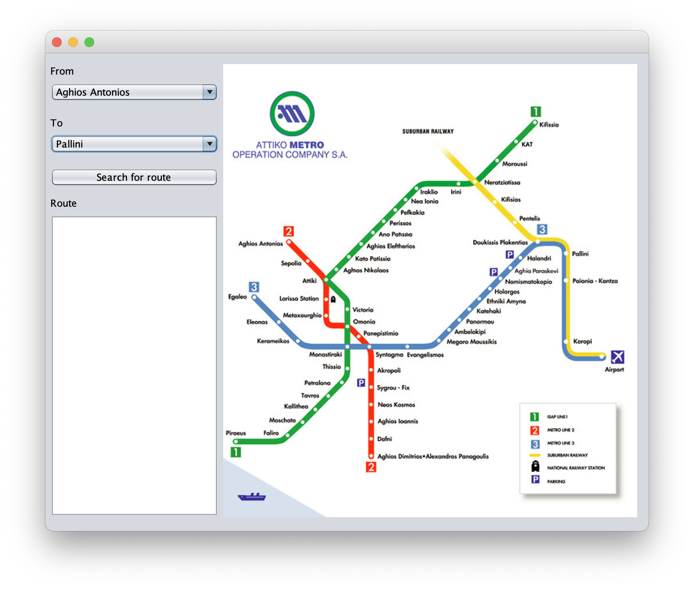
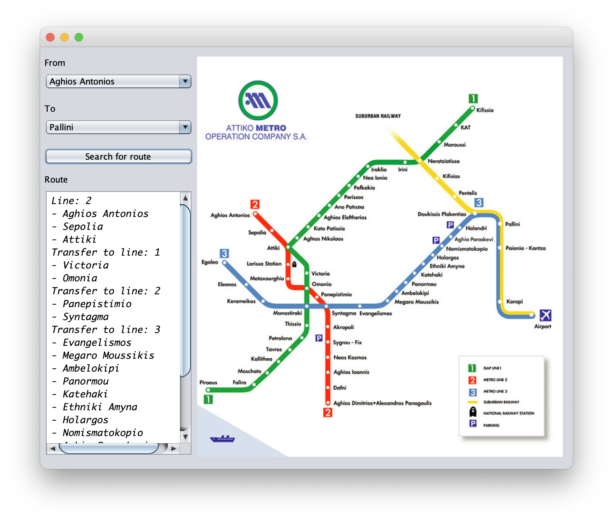

<h1>Destiny</h1>

Aplicación capaz de encontrar el camino más corto entre dos estaciones del metro de atenas.

<h2>Como poner en marcha la aplicacion</h2>

Correr el comando **make** en una terminal para compilar todas las clases java necesarias

**make run** para poner en ejecución la aplicación

**make clean** para eliminar todos los ficheros .class generados por el compilador

<h3>Contenido pantalla principal</h3>

<h3>Ruta para las estaciones seleccionadas</h3>
